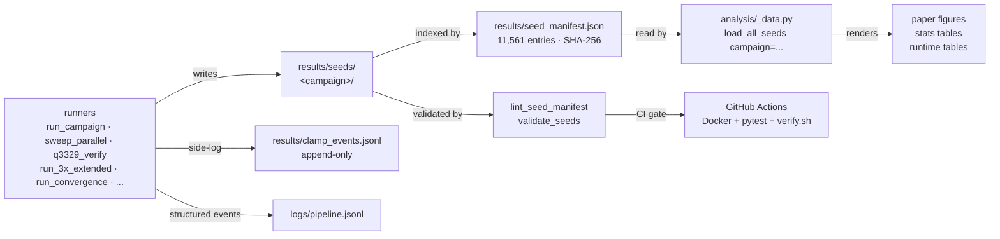

# BKZ Dynamical Systems Benchmark: Empirical Evaluation of Lattice Reduction via the Li–Nguyen Rankin Profile

[](https://github.com/BrendanChambersBourgeois/sdbkz-benchmark/actions)
[](https://doi.org/10.5281/zenodo.19686927)
[](LICENSE)
[](https://creativecommons.org/licenses/by/4.0/)
[](https://www.python.org/)

The CI workflow builds the Docker image from a fresh checkout and runs the numerical verification on every commit, so any environment-level reproducibility regression breaks the build immediately.

## 90-second quickstart

```bash
git clone https://github.com/BrendanChambersBourgeois/sdbkz-benchmark
cd sdbkz-benchmark
docker build -t sdbkz-benchmark:ci .                             # ~5 min
docker run --rm -e NUM_SEEDS=1 sdbkz-benchmark:ci bash scripts/verify.sh
# expected tail:
#   PASS  seed 1: advantage=0.211363 (ref=0.211363)
#   VERIFICATION PASSED
```

`verify.sh` regenerates one paper-reference seed from scratch inside the pinned container and compares the output against hardcoded reference values to 4 decimal places. Exits 1 on any numerical divergence.

### Troubleshooting

**`docker: permission denied while trying to connect to the Docker daemon socket`** — user not in `docker` group after install. Run once:

```bash
sudo usermod -aG docker $USER
newgrp docker    # or log out + back in
```

**`pytest: collected 0 items`** — `$(pwd)` expanded from a subdirectory. `cd` to the repo root before `docker run -v $(pwd)/...`.

**Fresh Ubuntu VM runs:** `pytest` and `analysis/paper_figures.py` should be invoked **inside the Docker image**, not host-side. The image pins all dependency versions (fpylll, numpy, MPFR) to the exact revisions used in the paper; system Python on a bare Ubuntu install has none of them.

**Bind-mounted files owned by root after a Docker run:** the image bakes a non-root user at UID/GID 1000:1000 by default (matches the most common Linux desktop). If your host UID/GID differs, override at build time:

```bash
docker build --build-arg HOST_UID=$(id -u) --build-arg HOST_GID=$(id -g) -t sdbkz-benchmark:ci .
```

Or with `docker compose`, export the env first (compose expands `${UID}`/`${GID}` automatically): `UID=$(id -u) GID=$(id -g) docker compose run --rm verify`. WSL users typically need this; native Linux on a default install usually does not.

## Engineering TL;DR

This repo is (a) the empirical data + papers for a two-engine lattice-reduction benchmark — 11,561 manifest-gated fplll seeds (LWE-Kannan + NTRU campaigns) plus 2,384 G6K sieve seeds under a separate engine manifest — and (b) a case study in defensive engineering for numerical experiments. Paper 1 (LWE-Kannan, published via Zenodo) is joined by paper 2 (in progress, `paper2/`): NTRU dense-sublattice-discovery onset and a cross-engine (enumeration vs sieving) study with G6K wired as a second reduction engine behind a determinism-gated seam. The headline finding is a **catastrophic-cancellation bug in fplll's Gram–Schmidt recurrence** (`fplll/gso_interface.cpp:147–151`) that corrupts 38% of bases at q=3329 n=100 β=30 with 1000-bit MPFR. A Kahan-compensated patch drops the rate to 0/55, passes all 15 fplll regression tests (16/16 with the bundled test), and reproduces bit-identical across Intel 13900K and AMD 9950X3D. The bug is a new instance of the cancellation family in fpylll #272; the patch was filed upstream as [fplll PR #550](https://github.com/fplll/fplll/pull/550) (2026-05-08), closed unmerged 2026-05-17, and is now kept **local-only** (not resubmitted). It ships in-repo, split as `patches/fplll_gso_kahan.patch` (code) + `patches/fplll_gso_kahan_tests.patch` (tests); paper §8 stands on its own. See paper §8 and `patches/README.md`.

The rest of the repo is the infrastructure that made finding it possible: pinned Docker builds, SHA-256-verified seed manifests (11,561 fplll entries + 2,384 G6K entries, both lint-gated in CI), byte-identical numerical output across three environments, per-claim evidence ledger, and 337 unit tests covering clamp semantics, file-identity dedup, manifest integrity, path migration, statistical helpers, NTRU construction checks, and the v2.0.0 symlink-drop regression guard.

## Engineering highlights

- **fplll cancellation bug + Kahan patch.** Paper §8.3 isolates a never-flagged numerical pathology in fplll's GSO computation triggered at cryptographic moduli. Full chain: diagnostic script → raw `get_r()` capture → cross-machine reproduction → algorithm-level root cause → Kahan patch → 55-seed regression rerun. `patches/fplll_gso_kahan.patch` is drop-in on fplll HEAD (commit `1987472`); filed as [fplll PR #550](https://github.com/fplll/fplll/pull/550) (2026-05-08), closed unmerged 2026-05-17, now kept local-only (see `patches/README.md`).

- **Verify-gated seed manifests.** `results/seed_manifest.json` indexes every fplll seed file with SHA-256, size, mtime, verified flag, per-seed advantage — 11,561 entries across 7 campaigns; `scripts/lint_seed_manifest.py` checks three invariants on every CI run (no orphan files, no ghost entries, no hash drift), 0 violations across the v1.3.x → v2.x release chain. The G6K engine has its own manifest (`results/g6k_seed_manifest.json`, 2,384 entries, `scripts/lint_g6k_manifest.py`) — the two engines' hashes are not comparable and are never merged (ADR-005).

- **Bit-identical reproducibility across 3 environments.** Intel 13900K / AWS Batch / AMD 9950X3D all produce byte-identical seed JSONs (SHA-256 hash of 100 seeds verified in `hash_verification.txt`). Different MPFR minor versions (4.2.0 vs 4.2.1), different CPU vendors, different container runtimes — no drift.

- **Append-only audit chain.** `results/clamp_events.jsonl` logs every defensive clamp fire (non-positive `get_r` value) with timestamp, script name, seed context. Never truncated per policy. `logs/pipeline.jsonl` receives structured events from every committed script (enforced by `scripts/lint_logging.py`).

- **CI-gated numerical reproducibility.** `.github/workflows/build-and-verify.yml` runs on every push: Docker build from scratch → import smoke tests → 345-test pytest suite (mypy strict on numerical-core, ruff F/W/I/B/UP, pytest --cov 75% floor) → `verify.sh` regenerating one seed in a fresh container and comparing SHA-256 → `verify_g6k.sh` exact-SHA gate on the G6K engine → `validate_seeds.py` schema + volume-drift checks → manifest lints + paper-figure parity gate. Any regression in any of these fails the build.

- **Incident-driven hardening.** Repo policies are written against real operational incidents, not conjectured ones. Defensive clamps must log raw values before substituting (introduced after a clamp hid the real `get_r` return for 9 days and produced a wrong Section 8 in a draft paper — see [`docs/incident_q3329_post_mortem.md`](docs/incident_q3329_post_mortem.md)). Data is never deleted without backup. `sudo` paths require explicit opt-in.

## Data-flow architecture



Every writer routes through `scripts/_seed_paths.py::seed_path_for()`. Every reader queries the manifest. Cross-validation via SHA-256 on read. The campaign tree (`main`, `q3329`, `cliff500`, `fplll_sensitivity`, `tours3x`, `convergence`, `ntru`, plus the engine-separate `ntru_g6k` and validation-only `ntru_patched`) is the single source of truth post-v1.3.

**v2.0.0 layout change.** The pre-v1.3 top-level seed directories (`results/raw/`, `results/cloud/`, `results/q3329/`, `results/cliff_500bit/`, `results/3x_tours/`, `results/convergence/`, `results/convergence_test/`, `results/fplll5*_sensitivity/`, etc.) lived as back-compat symlinks from v1.3 through v1.5.2 to give external citations time to re-path. They were retired at v2.0.0; `results/seed_path_crosswalk.csv` (4,387 rows, committed) is the permanent old→new reconciler. Any paper-era reference to a pre-v2 path resolves through that crosswalk to the canonical `results/seeds/<campaign>/...` location.

## License

- **Code** (scripts, analysis, Docker, patches): [MIT](LICENSE)
- **Papers and data** (`paper1/`, `paper2/`, `results/`): [CC-BY-4.0](https://creativecommons.org/licenses/by/4.0/)

## Project scope

This project benchmarks the **self-dual BKZ (SD-BKZ)** algorithm against standard BKZ for lattice basis reduction. Paper 1 measures convergence to the Li–Nguyen fixed-point Rankin profile on LWE-Kannan lattices across 11 dimensions (n=50–150), 3 block sizes (β=20, 30, 40), and 100 random seeds per configuration (122 for the four variance-filled groups) — 3,388 main-sweep runs. Paper 2 (in progress) extends to circulant NTRU — dimension-onset of the SD-BKZ advantage, a reference-free dense-sublattice-discovery (DSD) onset gap that grows with dimension, and a cross-engine study running the same instances through fplll's exact enumeration oracle and the G6K sieve.

## Current results (paper 1)

**More than 4,000 independent trials.** The main sweep is complete: 33 of 33 (n, β) groups at 100 seeds each — 122 for the four variance-filled groups — (3,388 runs). Beyond the main sweep: 500 seeds in 3× tour capability experiments, 40 seeds in 500-tour convergence tests (20 each at n=90 and n=140, β=30), 100 seeds in the q=3329 n=100 β=30 characterisation at 1000-bit MPFR, and 80 seeds in q=3329 verification at n=50/70/80/90 (β=30). The cloud campaign (AWS Batch) is complete and decommissioned as of 2026-04-10; all remaining work runs locally. Zero data loss across the campaign.

| Dimension | β=20 | β=30 | β=40 |
|---|---|---|---|
| n=50–80 | 98–100% win, d=1.7–2.7 | 100% win, d=2.8–3.0 | 90–100% win, d=1.3–3.6 |
| n=90 | 100% win, d=2.4 | **100% win, d=4.60, mean +0.922** | 100% win, d=3.04 |
| n=100 | 99% win, d=2.12 | **100% win, d=6.20, mean +1.346** | **100% win, d=9.40, mean +1.176** |
| n=110 | 92% win, d=1.47 | **100% win, d=5.64, mean +1.112** | **100% win, d=6.88, mean +1.158** |
| n=120 | 71% win, d=0.60 | 100% win, d=4.97, mean +0.741 | 44% win, mean −0.028 |
| n=130 | 54% win (coin flip) | 100% win, d=3.19, mean +0.352 | 0% win, mean −1.334 |
| n=140 | 22% win (BKZ wins) | 32% win, mean −0.036 (crossover) | 0% win, mean −1.452 |
| n=150 | 12% win (BKZ wins) | 0% win, mean −0.395 | 0% win, mean −1.293 |

All 33 groups at 100 seeds. Full statistical tables (95% CIs, Cohen's d, t-test and Wilcoxon p-values) in the paper.

Key findings (ordered most to least critical):

- **β=30 inverted-U:** Peak at n=100 (mean +1.346 nats, d=6.20, 100 seeds — largest effect in the dataset), declining through +0.741 at n=120, +0.352 at n=130, −0.036 at n=140, to −0.395 at n=150 (0% win). The backward pass becomes harmful at high dimensions even for the workhorse block size.

- **β=40 cliff:** 100% win at n=50–110 collapses to 44% at n=120 (mean −0.028) and crashes to 0% at n=130 (−1.334), n=140 (−1.452), and n=150 (−1.293). Not a gradual decline — a structural breakdown: a 2.5-nat swing over two dimension steps (n=110 → n=130).

- **Peak migration with block size:** β=40 overtakes β=30 at n=110 (+1.158 vs +1.112, both at 100 seeds). Stronger SVP oracle = higher peak in a narrower window of effectiveness, paired with a more violent post-peak collapse.

- **β/n threshold ≈ 0.20:** Below this ratio, SD-BKZ's advantage fades and reverses. β=20 fades at n=120 (71% win) and reverses at n=130 (54%). β=30 holds longer because it stays above the threshold across more of the dimension range.

- **Convergence is regime-dependent (500-tour test):** At n=90 β=30, BKZ flatlines after tour 70 while SD-BKZ keeps gaining out to tour 500 — advantage grows from +0.92 to +1.33 (100% win). At n=140 β=30, both algorithms slowly converge but BKZ wins at full convergence (mean −0.075 at tour 500). Pre-empts the "you didn't run BKZ long enough" objection at both ends.

- **3x tour capability gap:** BKZ at 210 tours cannot match SD-BKZ at 70. 0/400 gaps closed across n=50–80 at β=30. Stronger SVP oracle is not equivalent to more tours of a weaker one — it's a structural capability difference.

- **RHF is blind to the d(LN) advantage:** At n=100 β=30, d(LN) shows 100% win while RHF (root Hermite factor) shows 40%, with near-zero correlation (r=−0.08). The standard metric is structurally insensitive to the SD-BKZ effect — methodologically important for anyone using RHF as a quality measure.

- **q=3329 numerical instability in fplll's GSO (Section 8 of the paper):** At n=100 β=30 q=3329 (1000-bit MPFR, 100 seeds: 10 cloud + 45 Intel 13900K + 45 AMD 9950X3D), **38% of seeds (Wilson 95% CI [29.1%, 47.8%]) exhibit a degenerate final basis** with a Gram–Schmidt log-norm crashing to the precision floor (~−345). Root cause: the Cholesky-style squared-form GSO recurrence in `fplll/gso_interface.cpp:147–151` computes r(i,i) = ‖b_i‖² − Σ μ_{i,k}² · ‖b*_k‖² as a single scalar subtract with no compensation, reorthogonalisation, or sign check. A Kahan-compensated patch drops the rate from 38.0% (38/100 unpatched) to 0% (0/55 patched). The hit rate is near-symmetric across BKZ (25) and SD-BKZ (22), confirming the bug is in the shared GSO code path. Sharp dimension onset: 0/20 degenerate at n=50, 70, 80 and 1/20 at n=90, jumping to 38/100 at n=100. Cross-machine reproducible (Intel 38.2% vs AMD 37.8%; seed 11 bit-identical across architectures). This is a new instance of the cancellation family in fpylll #272 — not a new bug class — and was filed as [fplll PR #550](https://github.com/fplll/fplll/pull/550) (2026-05-08), closed unmerged 2026-05-17, now kept local-only. q=97 results are unaffected. All q=3329 results are Future Work in the paper.

- SD-BKZ costs 2.3–2.7× the runtime of BKZ across all configurations.

## Papers and patches

The `paper1/` directory holds the technical writeup documenting the benchmark design, results, and the fplll numerical bug findings; `paper2/` holds the in-progress NTRU + cross-engine technical report (`paper2/latex/`, same `make` flow). Paper 1 is generated from `paper1/latex/` via `make` and ships in both HTML and LaTeX form alongside the benchmark code:

| File | Purpose |
|---|---|
| `paper1/sdbkz_paper.html` | web-viewable HTML (drag into any browser) |
| `paper1/latex/sdbkz_paper_latex.tex` | LaTeX source (canonical) |
| `paper1/latex/sdbkz_paper_latex.pdf` | LaTeX-rendered PDF, 33 pages (canonical artifact) |
| `paper1/latex/Makefile` | `make` rebuilds the LaTeX PDF in one command |
| `paper1/latex/figs/` | 13 figures at 300 DPI, numbered in report order |
| `paper1/latex/{abbrev3,crypto,biblio}.bib` | Bibliography (cryptobib extract + local entries) |
| `paper1/latex/iacrj.cls`, `metacapture.sty` | Vendored IACR journal class (no submodule needed) |

To rebuild the LaTeX PDF from source:

```bash
cd paper1/latex && make
```

Requires a TeX Live distribution with `pdflatex`, `bibtex`, and standard LaTeX packages.

The **Kahan-compensated fplll GSO patch** referenced in paper §8.3 ships split in two: `patches/fplll_gso_kahan.patch` (code only — `gso_interface.cpp`/`.h`) and `patches/fplll_gso_kahan_tests.patch` (a separate regression-test diff), documented with apply-order in `patches/README.md`. Code-only applies cleanly to fplll HEAD (commit `1987472`, 15/15 regression tests; 16/16 with the tests patch). Filed as [fplll PR #550](https://github.com/fplll/fplll/pull/550), closed unmerged, now kept local-only. Only needed to reproduce the q=3329 numerical-instability analysis — `q=97` results are unaffected.

## Quick start

**New here?** Run an example first to confirm the install:

```bash
python3 examples/01_inspect_one_seed.py
```

This loads one existing result file and prints a summary — no new computation, runs in <1 second. See `examples/README.md` for the other examples and `COOKBOOK.md` for task-oriented snippets ("I want to add a new dimension", "I want to regenerate one figure", etc.).

### Verification sweep

Runs 5 seeds at (n=50, β=20) and checks results against known-good reference values:

```bash
# Via Docker
docker compose build sweep
docker compose run verify

# Or directly
bash scripts/verify.sh
```

### Full local experiment

```bash
# Via Docker
docker compose up sweep

# Or directly (recommended for long-running sweep)
tmux new-session -d -s sweep 'python3 scripts/sweep_parallel.py'
# progress: structured events in logs/pipeline.jsonl
```

The sweep is fully resumable — it scans `results/seeds/main/q97/` at startup and skips completed work. Results are written as individual JSON files per (n, β, seed) triple. A summary is regenerated every 10 completions to `results/summary.json`.

Worker count and timeouts are configured at the top of `scripts/sweep_parallel.py`:
- `NUM_WORKERS`: parallel pool size (default: 22)
- `TIMEOUT_BY_BETA`: per-seed timeout in seconds (2h / 4h / 8h by block size)

### Cloud experiment (AWS Batch)

For high-dimensional runs (n=120+) where per-seed runtime is too long for a single VM:

```bash
# Build and push the cloud container
docker build -f Dockerfile.cloud -t bkz-benchmark:latest .
# (then tag and push to ECR — see submit_jobs.py for details)

# Dry run
python3 scripts/submit_jobs.py --dry-run

# Submit specific group
python3 scripts/submit_jobs.py --n 100 --beta 30

# Submit with custom modulus and precision
python3 scripts/submit_jobs.py --n 100 --beta 30 --q 3329 --precision 1000

# Submit with 1 seed per job for max parallelism
python3 scripts/submit_jobs.py --n 150 --beta 40 --single-seed --vcpus 2

# Override seeds per job (default: 25)
python3 scripts/submit_jobs.py --n 100 --beta 30 --seeds-per-job 10
```

Cloud jobs run on on-demand instances (c7i/c6i) via AWS Batch, writing results to S3. Each job handles a chunk of seeds for one (n, β) group. The sweep script skips seeds already in S3, so resubmission is safe.

### sweep_cloud.py flags

The cloud runner (`scripts/sweep_cloud.py`) accepts the following arguments inside the container:

| Flag | Default | Description |
|---|---|---|
| `--n` | required | Lattice dimension |
| `--beta` | required | Block size |
| `--seed-start`, `--seed-end` | 1, 100 | Seed range |
| `--bucket` | — | S3 bucket for results |
| `--output` | — | Local output directory |
| `--workers` | auto | Parallel worker count |
| `--q` | 97 | LWE modulus (97 or 3329) |
| `--precision` | auto | MPFR precision in bits (250 for q≤97, 500 for q>97) |

**Precision notes:** q=3329 at n≥100 exposes a catastrophic-cancellation bug in fplll's squared-form GSO recurrence (paper §8). Higher MPFR precision delays the symptom but does not fix it — the root cause is arithmetic, not bit-width. 250-bit triggers visible GSO clamping, 500-bit produces per-tour d(LN) spikes of 100–300 nats, and 1000-bit still hits 38% degeneracy at n=100 β=30. Use the Kahan-compensated patch (paper §8.3) if you need clean q=3329 output.

### Watchdog system (decommissioned for the cloud campaign)

The cloud campaign is complete and the external watchdog is no longer running (AWS Batch compute environments disabled 2026-04-10). The two timeout systems below remain in the tree as architecture documentation and will activate automatically on any future cloud run:

1. **In-process watchdog** (`scripts/sweep_cloud.py`): kills the container if no seed completes within 2× the max expected seed time. q=3329 jobs get longer timeouts automatically.
2. **External watchdog** (`scripts/cloud_watchdog.sh`): designed to run via cron, terminates Batch jobs with no S3 progress. Q-aware — parses `--q` from the job command.

Both must be kept in sync. When updating timeouts, update both scripts and rebuild the Docker image.

## Analysis package

The `analysis/` directory is a Python package for generating figures, diagnostics, and tables from the per-seed JSON results. Each figure lives in its own module for easy navigation and selective use.

```
analysis/
  paper_figures.py          Entry point — CLI with argparse (77 lines)
  _style.py                 Shared color palette + matplotlib rcParams
  _data.py                  Data loading, lattice math, decomposition helpers
  plots/                      Content-named modules — no numbers; paper
                              figure numbers live in the paper itself.
    dimension_scaling.py      Hero figure: rise-peak-decline curves
    advantage_histograms.py   Per-group distribution + asymmetry
    convergence_trajectories.py   Per-tour d(LN) at 4 representative groups
    tour_test_3x.py           Capability vs speed evidence
    spatial_decomposition.py  Head/mid/tail profile breakdown
    absolute_dln.py           Absolute d(LN) for both algorithms
    beta_n_scatter.py         β/n ratio vs advantage (threshold visual)
    dln_vs_rhf.py             d(LN) reveals what RHF cannot see
    basis_profiles.py         Mean Rankin profile shapes
    gso_profiles.py           GSO log-norm staircase with GSA + LN predictions
    convergence_500_tours.py  Two convergence regimes (n=90 + n=140)
    q3329_degeneracy.py       q=3329 structural instability
    _orchestrator.py          generate_all() — runs the full pipeline
  diagnostics.py            Distribution, crossover tour, runtime, n=90 deep dive
  tables.py                 Paper-ready text tables (main results, statistics, spatial)
  stats_analysis.py         Standalone statistical analysis CLI
  runtime_table.py          Runtime table generator (JSON + paste-ready HTML)
```

**Generate all figures:**

```bash
python3 analysis/paper_figures.py
```

**Use individual figures programmatically:**

```python
from analysis._data import load_all_seeds
from analysis.plots import fig_dimension_scaling

groups = load_all_seeds(campaign="main")
fig_dimension_scaling(groups, output_dir="./figures")
```

## Experiment scripts

Canonical entry point (v2.0.0 consolidation):
- **`scripts/run_campaign.py`** — Single-entry dispatcher driven by `config/sweep.toml`. Routes by campaign name to the right underlying runner (q3329_verify for main/cliff500/q3329, run_convergence for convergence_*, run_3x_extended for tours3x, Docker-image instructions for fplll_sensitivity). Usage: `python3 scripts/run_campaign.py --campaign <name> [--n N] [--beta B] [--start S] [--end E] [--seeds N] [--workers W] [--dry-run]`. Replaces six per-cell launcher scripts (`run_cliff_500bit.py`, `run_n100_beta40.py`, `run_q3329_n90.py`, `run_q3329_n100_local.py`, `run_overnight_q3329_intermediate_1000bit.py`, and the dispatch surface of `run_fplll54_sensitivity.py`) deleted at v2.0.0 consolidation.

Workhorses (called by the dispatcher; also usable standalone):
- **`scripts/sweep_parallel.py`** — Local VM q=97 sweep workhorse (multiprocessing pool). Walks the canonical `results/seeds/main/q97/` tree.
- **`scripts/q3329_verify.py`** — q-aware sweep workhorse (handles main, cliff500, q3329 via `--q` / `--precision` overrides). Writes to the campaign tree via `_seed_paths.seed_path_for`.
- **`scripts/sweep_cloud.py`** — Cloud sweep runner (S3-backed, Docker). Includes in-process watchdog. Cloud decommissioned 2026-04-10; preserved for reproducibility of the cloud-half of the paper sweep.
- **`scripts/run_sweep_fill.py`** — Argparse fill runner for partial cells (`--n --beta --start --end`).
- **`scripts/run_3x_extended.py`** — 3× tour capability test (GROUPS list overridable).
- **`scripts/run_convergence_test.py`** — Convergence test (module-level N/BETA/MAX_TOURS).
- **`scripts/run_convergence.py`** — Argparse wrapper around `run_convergence_test` (`--n --beta --max-tours --seeds --workers`).
- **`scripts/run_fplll54_sensitivity.py`** — Cross-image sensitivity check (5 seeds at the canonical n=100 β=30 cell under a Dockerfile.fplll54 build that source-builds fplll 5.4.x against numpy<2).

Cloud / submission / ops:
- **`scripts/submit_jobs.py`** — AWS Batch job submission. Flags: `--n`, `--beta`, `--q`, `--precision`, `--vcpus`, `--single-seed`, `--seeds-per-job`, `--dry-run`.
- **`scripts/cloud_watchdog.sh`** — External watchdog for Batch jobs, Q-aware timeouts (decommissioned with the cloud campaign; retained for future use).
- **`scripts/overnight_experiments.py`** — Orchestrates multi-group runs on a single machine.

Data hygiene and logging:
- **`scripts/validate_seeds.py`** — Per-seed schema and volume-drift validator; enforces a 0.1-nat volume-preservation threshold tuned against the 1,960-seed q=97 dataset.
- **`scripts/split_fat_seeds.py`** — Splits `*_fat.json` per-tour trajectory companion files from the lean seed records.
- **`scripts/log.py`** — Shared logging helper that emits structured events to `logs/pipeline.jsonl` (every committed script routes through it).

## Data format

Each per-seed result is written as two JSON files next to each other under the canonical campaign tree (e.g. `results/seeds/main/q97/n100_beta30/`):

- **`seedNNNN.json` (lean)** — the canonical record: inputs, final d(LN) for BKZ and SD-BKZ, initial Rankin profile, termination reason, wall-clock time, SHA-256 inputs. This file defines the seed's identity and is what reproducibility verification hashes against. Cloud-half copies carry the `_cloud` suffix; per-tour fat companions carry `_fat`.
- **`seedNNNN_fat.json` (companion)** — optional per-tour trajectories and full Gram–Schmidt log-norm profiles. Present for groups where the sweep was run with `store_per_tour=True`. Absent fat files never invalidate a seed.

`scripts/archive/split_fat_seeds.py` (one-shot, kept for audit chain) performs the split when a legacy run produced a single combined file. Downstream analysis code in `analysis/_data.py` tolerates either layout.

### Supplementary artifacts

- **`results/profile_decomposition.json`** — full head/middle/tail Rankin-profile decomposition for all 33 groups, referenced by Table 5 in the paper (the table shows a representative n=50–70 subset only).
- **`results/paper_claims/`** — per-claim evidence ledger: one JSON per paper claim with the raw numbers, seed counts, and source sweep paths used to derive it. Cross-references every quantitative statement in the paper.
- **`results/hash_verification.txt`** — SHA-256 hashes for the 100-seed cross-environment verification at n=100, β=20 (VM Ubuntu 24.04 / MPFR 4.2.1 vs AWS Batch Debian Bookworm / MPFR 4.2.0), bit-identical on all 100 seeds.

## Reproducibility

All results are produced with identical software versions across three independent environments:

| Component | Version | Local VM (Intel 13900K) | AWS Batch | Secondary (AMD 9950X3D) |
|---|---|---|---|---|
| Python | 3.12.3 | Ubuntu 24.04 | Debian Bookworm | Ubuntu 24.04 |
| fpylll | 0.6.4 | pip | pip (Docker) | pip (Docker) |
| fplll | 5.5.0 | bundled in fpylll | bundled in fpylll | bundled in fpylll |
| numpy | 2.4.4 | pip | pip (Docker) | pip (Docker) |
| MPFR | 4.2.x | 4.2.1 | 4.2.0 | 4.2.1 |
| cysignals | 1.12.6 | pip | pip (Docker) | pip (Docker) |

**SHA-256 verification:** All 100 seeds of (n=100, β=20) were computed independently on the Intel and AWS environments and are bit-identical across all seeds (see `hash_verification.txt`). A cross-architecture smoke test on the q=3329 n=100 β=30 seed 11 produced bit-identical output between Intel 13900K and AMD 9950X3D (0/70 per-tour trajectory differences, exact match on `bkz_final_dln` and `sdbkz_final_dln` to 10 decimal places), ruling out any microarchitecture-specific cause for the numerical findings in paper §8. The MPFR 4.2.0 vs 4.2.1 difference does not affect output.

See `Dockerfile` (local) and `Dockerfile.cloud` (AWS) for exact build specs. Python dependencies are pinned in `pyproject.toml`.

## Acknowledgements

The author thanks Dylan Chambers Bourgeois for contributing compute resources (AMD Ryzen 9 9950X3D) and cross-architecture reproducibility verification during the β = 40 sweep campaign. The author also thanks Trill White (Deakin University) for early feedback and discussions on the benchmark results.

## References

Core references for the benchmark design and the algorithms under test. The full 15-reference bibliography lives in the paper.

- Li, J. & Nguyen, P.Q. (2024). "A Complete Analysis of the BKZ Lattice Reduction Algorithm." *Journal of Cryptology*. IACR ePrint 2020/1237. *(Defines the Rankin-profile fixed point and the d(LN) metric this benchmark is built around.)*
- White, T. (2026). "Dynamic analysis of lattice basis reduction algorithms." *AMSI Summer Research Scholarships 2025–26*, Deakin University. [Profile](https://srs.amsi.org.au/student-profile/trillion-white/) · [Report (PDF)](https://srs.amsi.org.au/wp-content/uploads/sites/92/2026/03/white_trill_srs-report.pdf)
- [fplll](https://github.com/fplll/fplll) — Lattice algorithms library; every BKZ and SD-BKZ call in this benchmark goes through fplll 5.5.0.
- [fpylll](https://github.com/fplll/fpylll) — Python bindings for fplll (0.6.4).
- Micciancio, D. & Walter, M. (2016). "Practical, Predictable Lattice Basis Reduction." *EUROCRYPT 2016*, LNCS 9665, pp. 820–849. Full version: ePrint 2015/1123.
- Hanrot, G., Pujol, X. & Stehlé, D. (2011). "Analyzing Blockwise Lattice Algorithms Using Dynamical Systems." *CRYPTO 2011*, LNCS 6841, pp. 447–464.
- Chen, Y. & Nguyen, P.Q. (2011). "BKZ 2.0: Better Lattice Security Estimates." *ASIACRYPT 2011*, LNCS 7073, pp. 1–20.
- Gama, N. & Nguyen, P.Q. (2008). "Predicting Lattice Reduction." *EUROCRYPT 2008*, LNCS 4965, pp. 31–51.
- Schnorr, C.P. & Euchner, M. (1994). "Lattice basis reduction: improved practical algorithms and solving subset sum problems." *Mathematical Programming*, 66, pp. 181–199.
- Bai, S., Stehlé, D. & Wen, W. (2018). "Measuring, Simulating and Exploiting the Head Concavity Phenomenon in BKZ." *ASIACRYPT 2018*, LNCS 11272, pp. 369–404. ePrint 2018/856.
- Aono, Y., Wang, Y., Hayashi, T. & Takagi, T. (2016). "Improved Progressive BKZ Algorithms and Their Precise Cost Estimation by Sharp Simulator." *EUROCRYPT 2016*, LNCS 9665, pp. 789–819.
